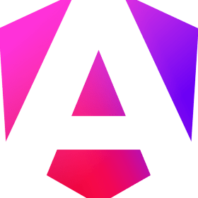
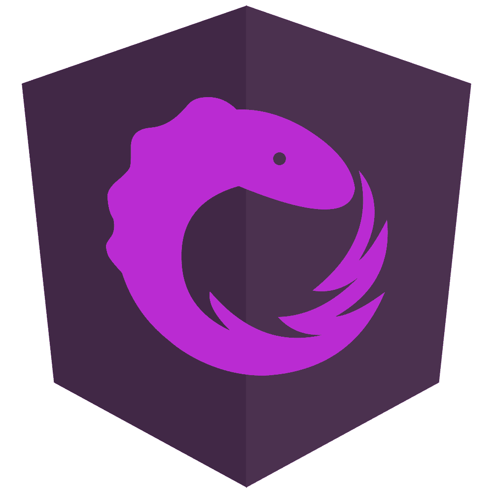
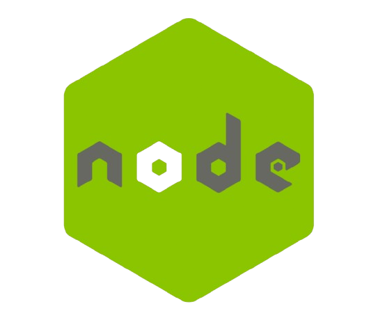

<!-- markdownlint-disable -->
<table>
<tr>
<td width="50%" valign="top">

# &nbsp; **👋Hi, I'm Hossain**

  
  
- 🔭 I'm presently practicing my back-end developing skills.
- 🌱 Currently, my focus lies in mastering Angular.js and Nest.js, while diligently constructing projects that facilitate hands-on learning.
- 👯 Seeking to contribute to the open source community, I eagerly welcome collaborations on TypeScript/Javascript projects.
- 😄 With a passion for constant growth, I enjoy exploring novel skills and seamlessly integrating them into my project repertoire.

<h4>  &nbsp; For professional inquiries or meaningful conversations, please reach out to me at !!</h4>

  
  
  

  

    
  

  
  

</td>

<td width="50%" valign="top">

### 🛠 &nbsp;Tech I Like

 

 

 

 

 
<!--  -->
<!--  -->

 

  

</td>
</tr>
  
</table>

<!-- 

  <h3>Featured Repository =: </h3> 
    
    
    
    
     
    
       
    

-->

<h3 align="center"> GitHub Analytics 📊 </h3>  

<!--    -->
  

